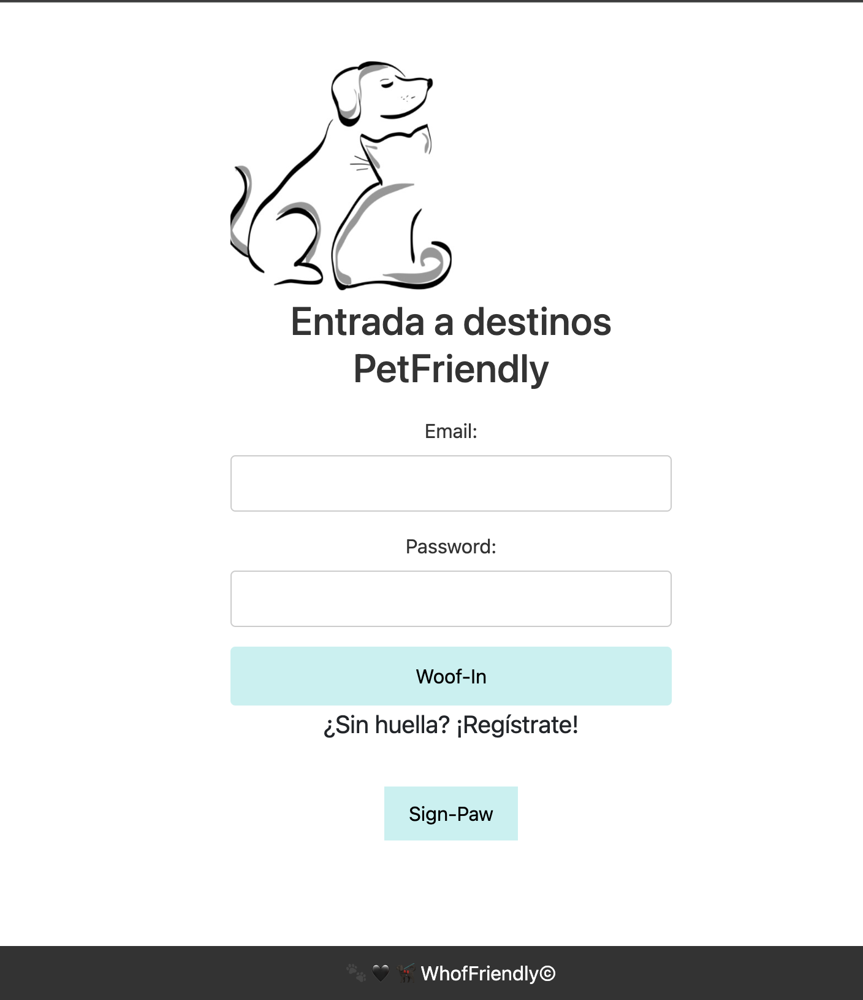
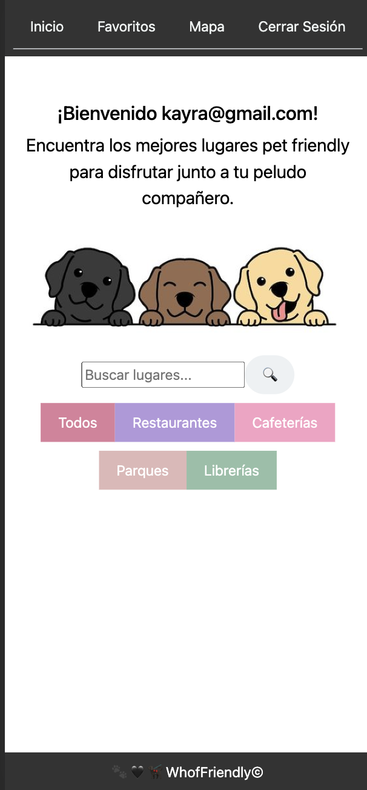
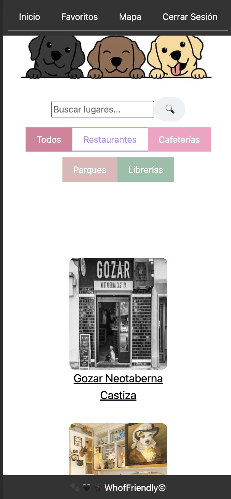
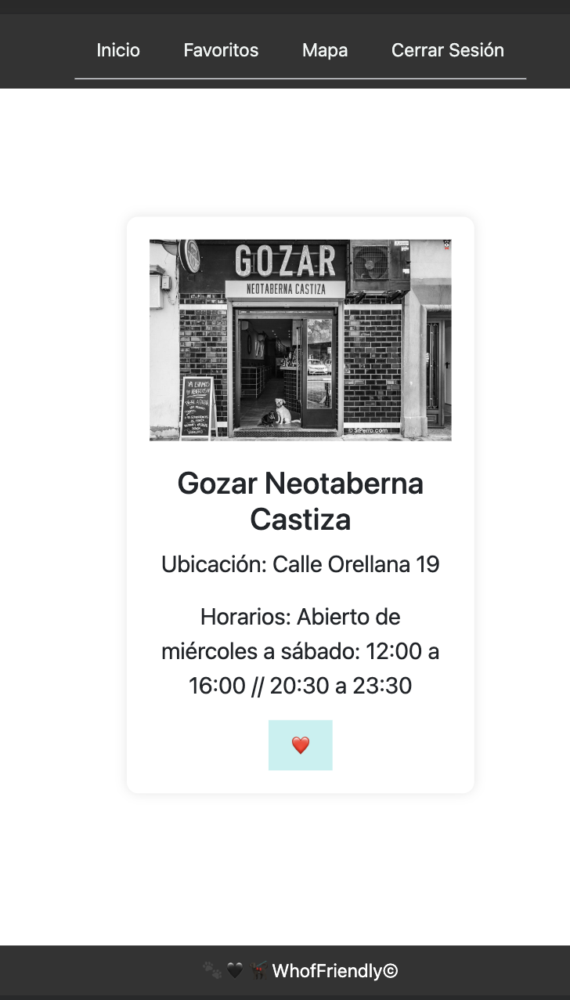
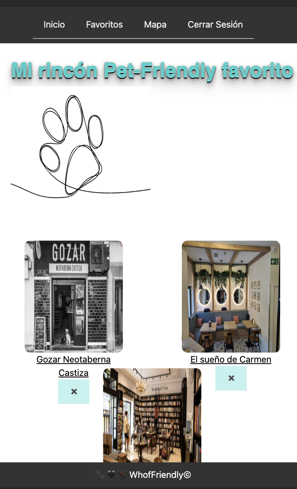
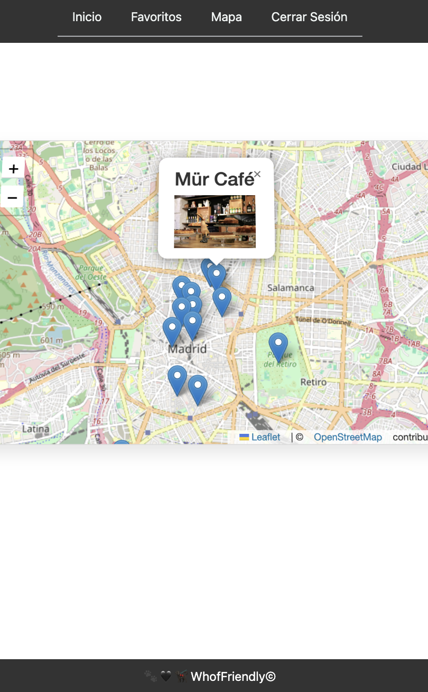

# Proyecto Full Stack: Buscador de Lugares Petfriendly

## Descripción del Proyecto

Esta aplicación Full Stack permite a los usuarios buscar lugares Petfriendly y guardar sus favoritos. Los usuarios pueden autenticarse para acceder a características adicionales, como guardar lugares y ver sus favoritos. La aplicación utiliza una API REST con Express en el backend y una interfaz de usuario construida en React en el frontend.

## Tecnologías Utilizadas

- **Backend:**
  - Express (Node.js)
  - PostgreSQL (Base de Datos)
  - Pruebas Unitarias
  - Otras Librerías (detallar según sea necesario)

- **Frontend:**
  - React
  - Bootstrap y Normalize.css (Librerías de Estilos)
  - Mapas (detallar la librería utilizada)

## Configuración del Proyecto

1. **Clonar el Repositorio:**
2. cd proyecto/backen/client : npm install
3. cd proyecto/frontend : npm install
4. Configurar la Base de Datos PostgreSQL, las querys se encuentran en el repositorio.
5. Para los dos servidores: npm run dev.

## Funcionalidades Principales

- **CRUD de Datos:**
  - Realiza operaciones de Crear, Leer, Actualizar y Eliminar datos a través de las rutas de la API.

- **Búsqueda y Filtrado:**
  - Permite a los usuarios buscar lugares Petfriendly por nombre.
  - Ofrece opciones de filtrado mediante botones de categorías según el tipo de lugar.

- **Autenticación de Usuarios:**
  - Implementa un sistema de autenticación para que los usuarios puedan acceder a funcionalidades exclusivas.

- **Gestión de Favoritos:**
  - Permite a los usuarios guardar lugares en su lista de favoritos.
  - Ofrece una vista de favoritos con el listado de lugares guardados.

## Testing

- Se implementaron algunas pruebas unitarias.

## Capturas de Pantalla

## FUTURAS MEJORAS

### Autenticación de Usuarios real con Passport y OAuth (por ejemplo, Google)

Implementar una autenticación de usuarios más robusta utilizando Passport.js. Esto permitirá a los usuarios autenticarse mediante OAuth con servicios populares como Google. Esto añade una capa adicional de seguridad y comodidad.

### Documentación con Swagger

### Más Testing

Ampliar la cobertura de pruebas unitarias y de integración.

### Controlador de Administrador

Implementar un controlador de administrador que permita la gestión de usuarios, lugares y reseñas.

### Reseñas de Lugares y Comentarios de Usuarios

Agregar la capacidad para que los usuarios dejen reseñas y comentarios sobre los lugares.

### Mejoras en la Interfaz de Usuario

Realizar mejoras en la interfaz de usuario para proporcionar una experiencia más intuitiva y atractiva. 

